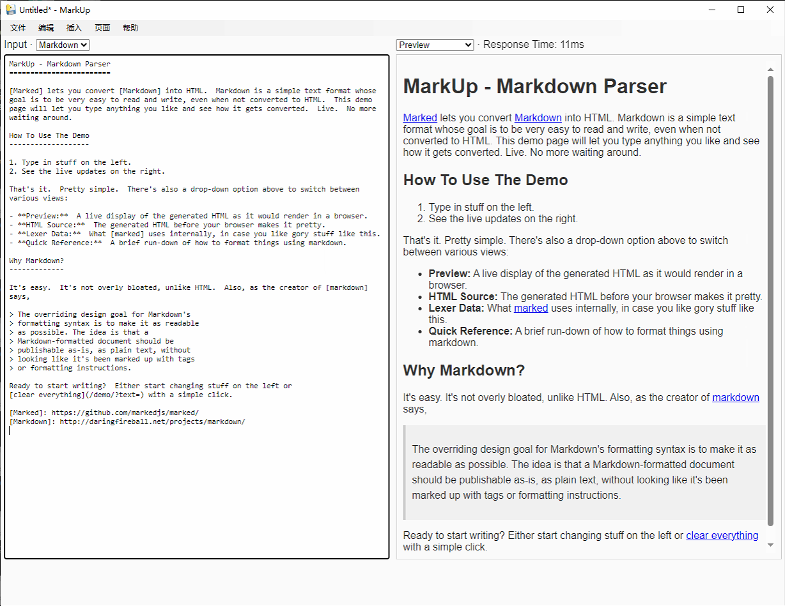
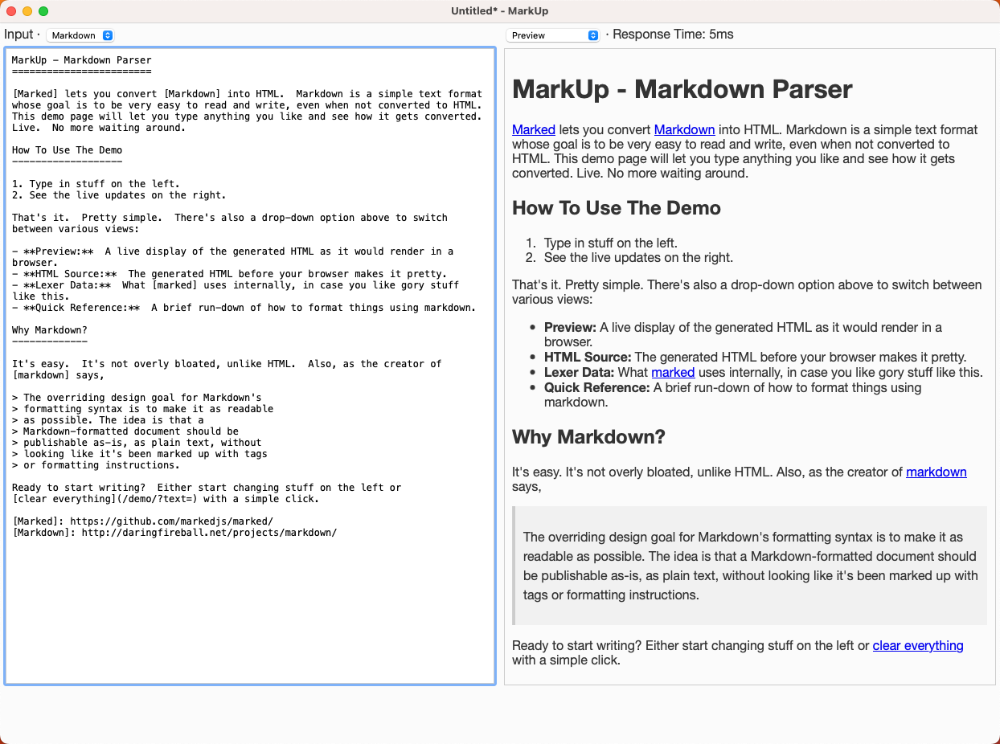
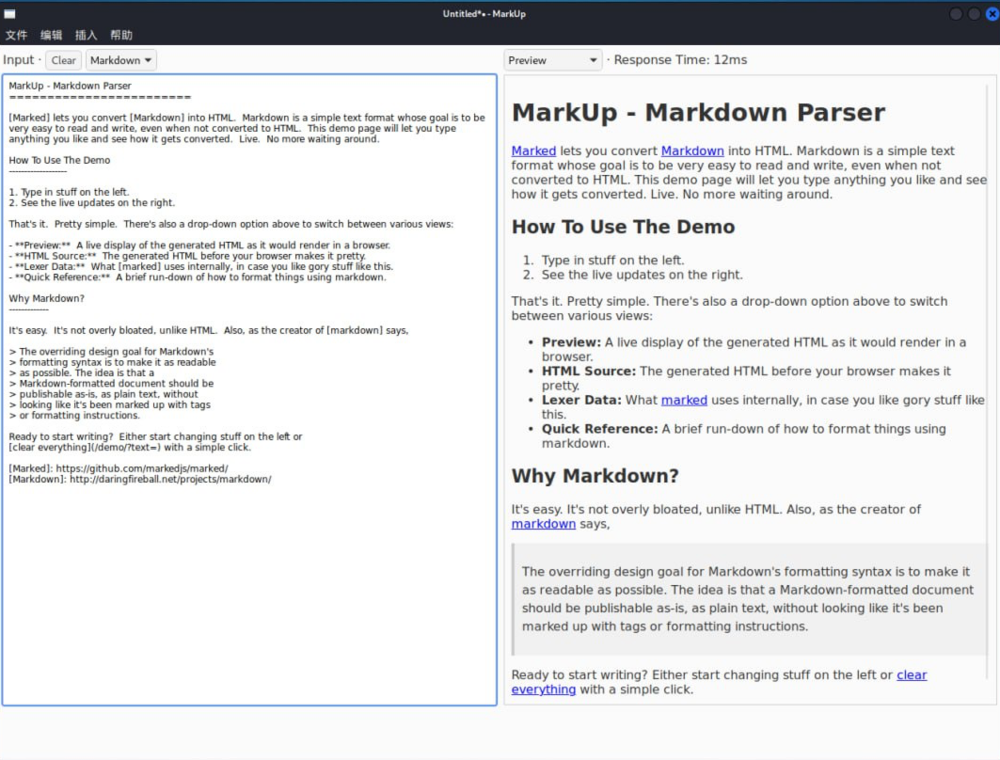

# MarkUp
Markdown Parser Software.

## 前言

此项目的目的是介绍使用 `python` 快速开发 `GUI` 的方法；
不使用 `pyqt`, `pyside` 之类的工具，而是使用 `pywebview` 开发和转化已有 `web` 项目来达到高效的目的。

> 目前只放出运行示例图，后面会放上 `windows`, `macos`, `linux` 平台的包。

windows 中运行图：

macos 中运行图：

linux 中运行图：

其它部分说明（项目运行，打包，安装，文档，releases 附件等）待补充，很快到来。
